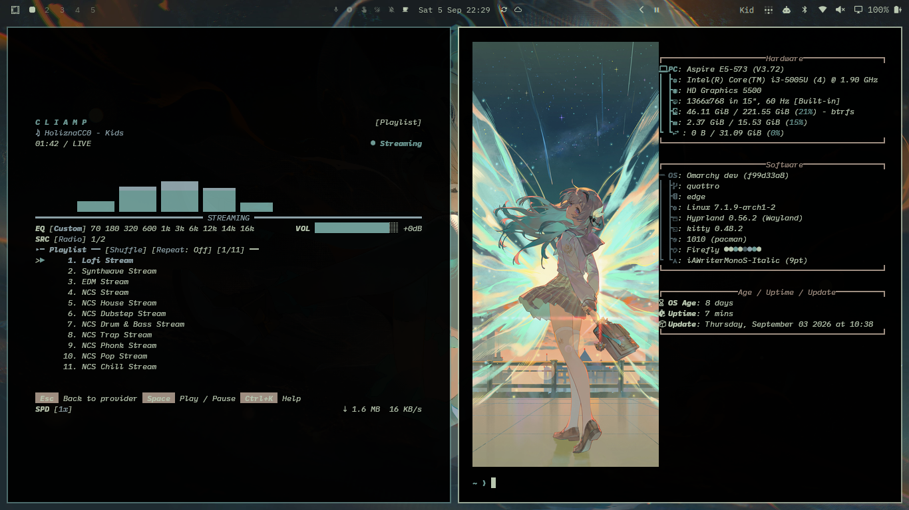
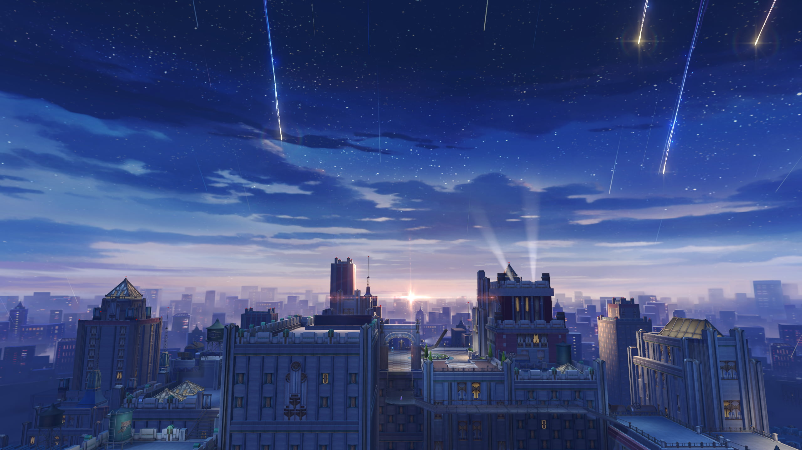
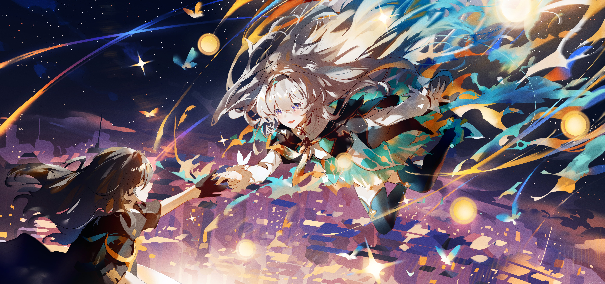
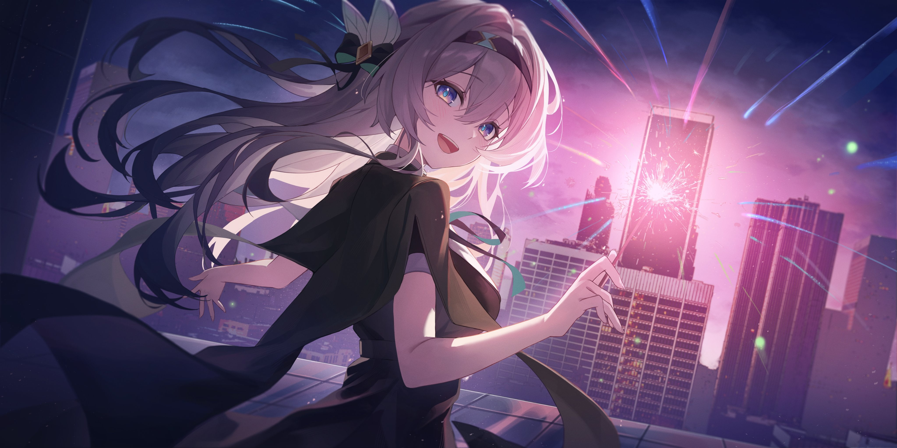
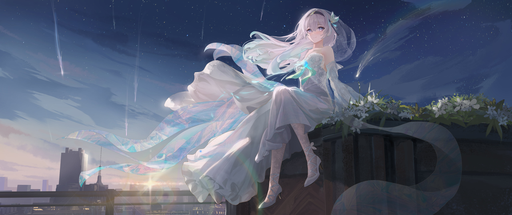
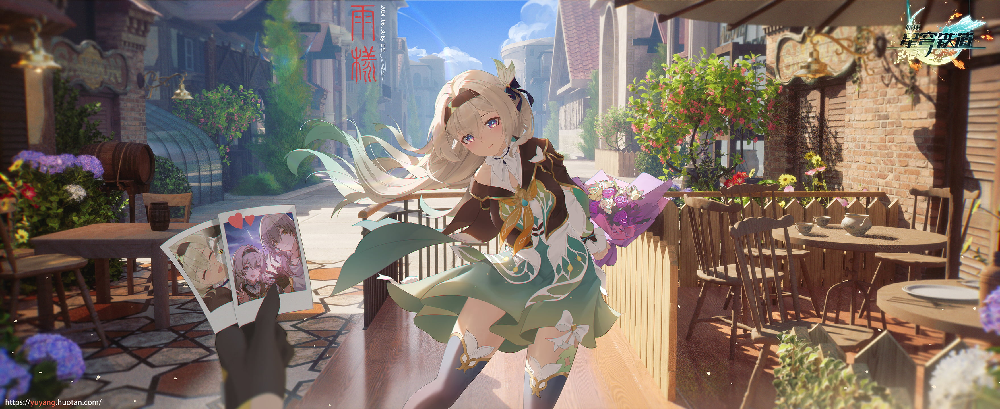
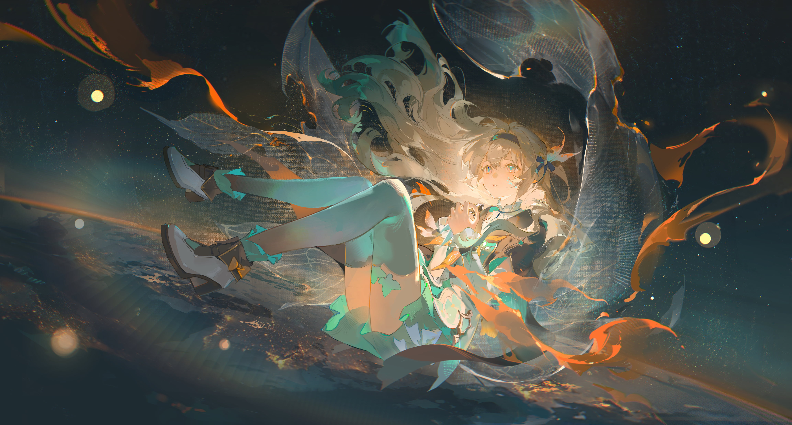
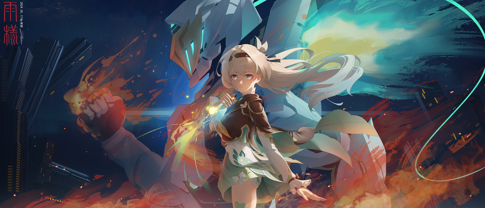
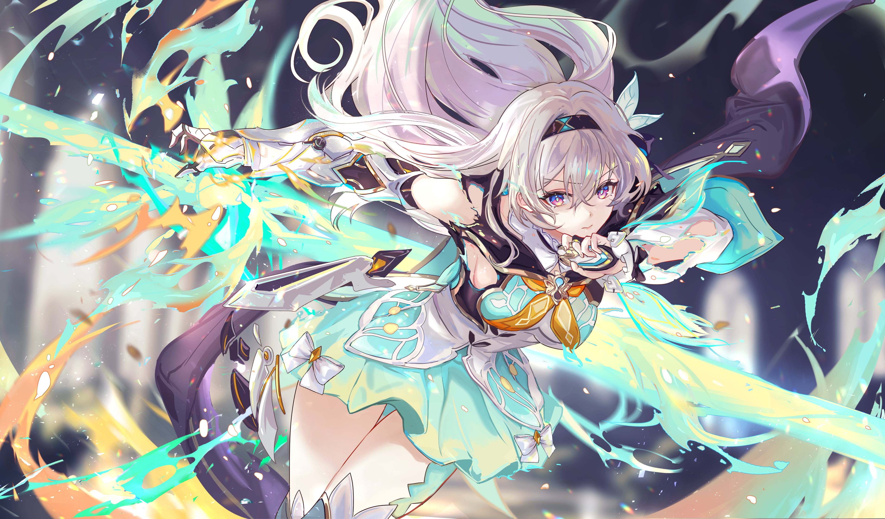
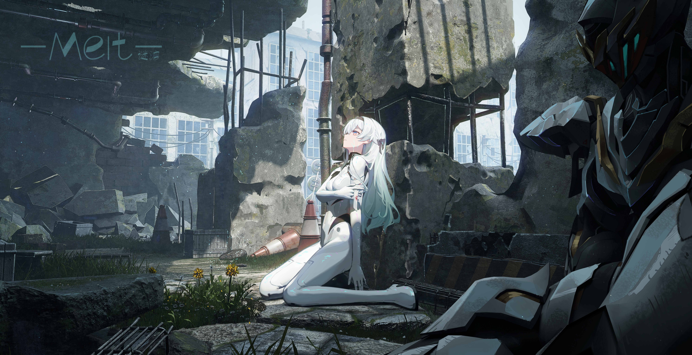

# Omarchy Firefly Theme

Firefly is a dark Omarchy theme inspired by the character from Honkai Star Rail, featuring vibrant cream/off-white accents against a true black background, with teal-green structural tones and highlights. Rounded glass surfaces with luminous quality and flowing forms capture her energetic essence.

## Preview



## Install

### Option 1: Complete local install (Recommended)
For a complete install with automatic backups, VS Code theme extension synchronization, transparent background window rules, and a clean uninstall path, run:

```bash
./install.sh
```

- Installs Firefly as an Omarchy theme matching official template specifications.
- Configures Kitty with clean transparent background (`background_opacity 0.80`).
- Configures Hyprland with border gradients and transparency rules for VS Code, Cursor, and VSCodium.
- Automatically generates and synchronizes the rich Firefly color theme extension for VS Code / Cursor.
- Creates automatic backups of previous theme, wallpaper, and editor settings.

Restore previous configuration at any time with:

```bash
./uninstall.sh
```

### Option 2: Standard Omarchy installer
To install directly from the remote git repository:

```bash
omarchy-theme-install https://github.com/Johnyyd/omarchy-firefly-theme
```

## What's Included

- **Hyprland Window Rules**: Window transparency rules (`0.80` active, `0.75` inactive) for VS Code, Cursor, VSCodium, Antigravity IDE, GitHub Desktop, Obsidian, Zed, Discord, Slack, Telegram, Spotify, and Nautilus.
- **Terminals**: Clean transparent background configurations (`0.80` opacity, blur disabled) for Kitty, Alacritty, Ghostty, and Foot.
- **TUIs & Monitors**: Native transparent terminal backgrounds for `btop` (`main_bg=""`), `helix` (`ui.background={}`), and `neovim`.
- **VS Code / Cursor / VSCodium**: Full multi-color syntax highlighting (`vscode-theme.json`) covering TextMate scopes and semantic tokens:
  - **Keywords & Control Flow**: `#FF7A3D` (Firefly Flame Orange)
  - **Functions & Methods**: `#FFB347` (Golden Yellow)
  - **Types & Interfaces**: `#739099` (Steel Blue-Grey)
  - **Strings**: `#6F9C97` (Teal Green)
  - **Variables & Parameters**: `#E85D2A` (Warm Coral / Amber)
- **Editors & TUIs**: Native configurations for Neovim (`aether.nvim` v3 with LazyVim), Helix, Pi, Claude CLI, and Zed.
- **Desktop Integrations**: Styled layouts for Waybar, Mako, Walker, SwayOSD, and Hyprlock.
- **Vencord Theme**: Standalone [Vencord theme](vencord.theme.css) with custom layered treatment for Discord.

## Wallpapers

<table>
  <tr>
    <td></td>
    <td></td>
    <td></td>
  </tr>
  <tr>
    <td></td>
    <td></td>
    <td></td>
  </tr>
  <tr>
    <td></td>
    <td></td>
    <td></td>
  </tr>
</table>

### Animated Wallpapers

The `backgrounds/` directory also includes six optimized 4K H.264 loops for setups that support animated wallpapers. Their original 3840×2160 resolution and frame rates are preserved.

Omarchy Quattro's built-in background picker currently selects static image formats only, so these videos are intentionally shipped as optional assets for an animated-wallpaper tool such as `mpvpaper`. They do not replace the static wallpapers or interfere with normal theme switching.

## Requirements

- Omarchy 4.0 (Quattro) for native shell and Hyprland Lua treatment
- `Yaru-prussiangreen` icon theme
- Optional animated-wallpaper renderer for the bundled MP4 loops
